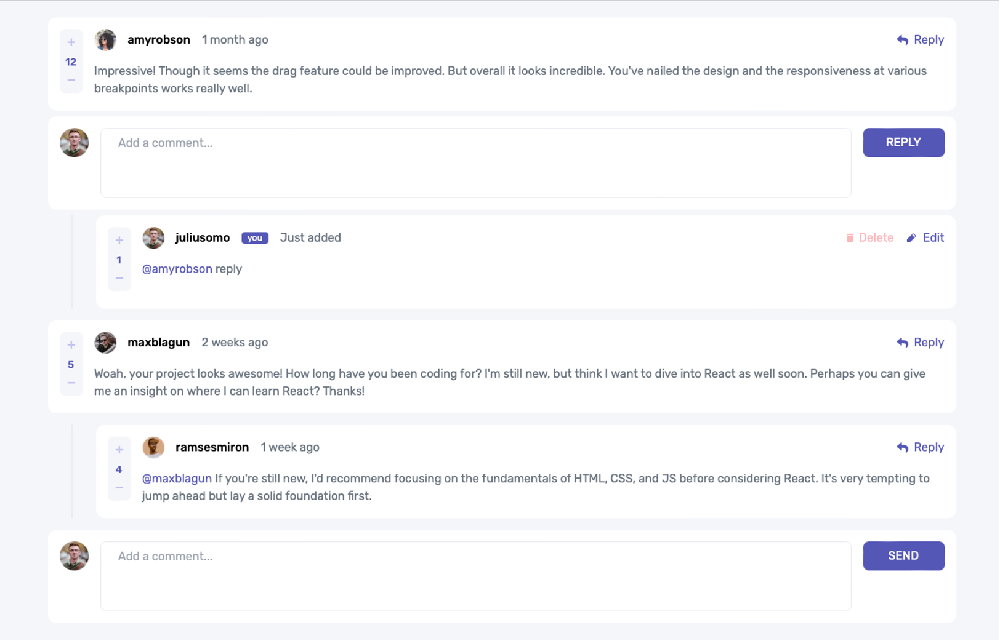

# Frontend Mentor - Interactive comments section solution

This is a solution to the [Interactive comments section challenge on Frontend Mentor](https://www.frontendmentor.io/challenges/interactive-comments-section-iG1RugEG9). Frontend Mentor challenges help you improve your coding skills by building realistic projects.

## Table of contents

- [Overview](#overview)
  - [The challenge](#the-challenge)
  - [Screenshot](#screenshot)
  - [Links](#links)
- [My process](#my-process)
  - [Built with](#built-with)
  - [What I learned](#what-i-learned)
  - [Continued development](#continued-development)
- [Author](#author)

## Overview

### The challenge

Users should be able to:

- View the optimal layout for the app depending on their device's screen size
- See hover states for all interactive elements on the page
- Create, Read, Update, and Delete comments and replies
- Upvote and downvote comments
- I have not

### Screenshot



### Links

- Solution URL: https://github.com/Jake-Oz/interactive-comments3
- Live Site URL: https://interactive-comments3.vercel.app

## My process

### Built with

- Tailwind CSS
  - Flexbox
  - Dynamic Utilities
- Typescript
- [React](https://reactjs.org/) - JS library
- [Next.js](https://nextjs.org/) - React framework

### What I learned

Wow - this was tougher than I thought it would be. While creating the app components was fairly straight forward, managing state and storage was a challenge for me. I first tried to use a SQL Database utilising Prisma as the ORM. This worked OK but I could not get my head around the dependencies between the comments and the replies which made it hard to manage updates and deletions etc.

So => I simplified and kept state local using the Zustand (https://github.com/pmndrs/zustand) package. Still needed to do lots of mapping and filtering but I learned a lot in the process.

Here is a snippet of the UpdateComment function I created within the Zustand based Hook:

```ts
 updateComment: (updatedContent: string, id: number) =>
    set((state) => {
      const updatedComments = state.comments.map((comment) => {
        // check replies for id.
        if (comment.replies.length > 0) {
          const updatedReplies = comment.replies.map((reply) => {
            if (reply.id === id) {
              return { ...reply, content: updatedContent };
            } else {
              return reply;
            }
          });
          return { ...comment, replies: updatedReplies };
        } else if (comment.id === id) {
          return { ...comment, content: updatedContent };
        } else {
          return comment;
        }
      });
      return { comments: updatedComments };
    }),
```

### Continued development

I would now like to get back to work on the backend database to provide a more realistic permanent storage option. If anyone has cracked the Scheme for that, please reach out.

## Author

- Frontend Mentor - [@Jake-Oz]https://www.frontendmentor.io/profile/Jake-Oz
